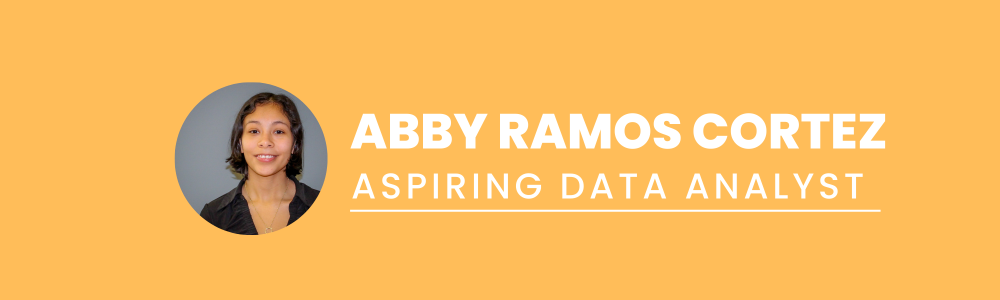

### Hi, I'm Abby👋      

### I'm currently learning Data Analytics and am working Projects:
  - [**Data Analyst Bootcamp** by AlextheAnalyst](https://youtube.com/playlist?list=PLUaB-1hjhk8FE_XZ87vPPSfHqb6OcM0cF)
  -  Please feel free to take a look at my [**Data Analytics Portfolio!**](https://github.com/aramoscortez/Portfolio-Projects)
  -  Also, make sure to check out my [**Schoolwork Portfolio!**](https://github.com/aramoscortez/Schoolwork)
  
### Here are some books📖 I've read:
  - *Think Java*, Second Edition by Allen Downey and Chris Mayfield
  - *SQL Quickstart Guide: The Simplified Beginner's Guide to Managing, Analyzing, and Manipulating Data with SQL* by Walter Shields
  - *Beginning R: The Statistical Programming Language* by Dr. Mark Gardener
  - *Introductory Statistics with R* by Peter Dalgaard

### Here are some books📖 I am currently reading:
  - *Data Analytics Made Accessible* by Dr. Anil Maheshwari
  - *Storytelling with Data: A Data Visualization Guide for Business Professionals* by Cole Nussbaumer Knaflic
  - *Data Science for Business: What You Need to Know about Data Mining and Data-Analytic Thinking* by Foster Provost and Tom Fawcett

